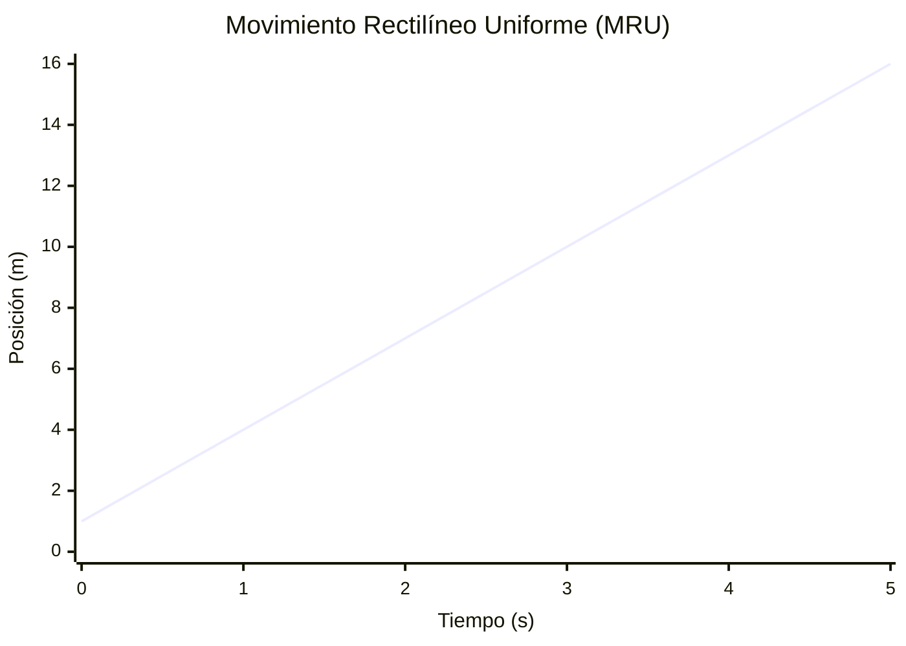
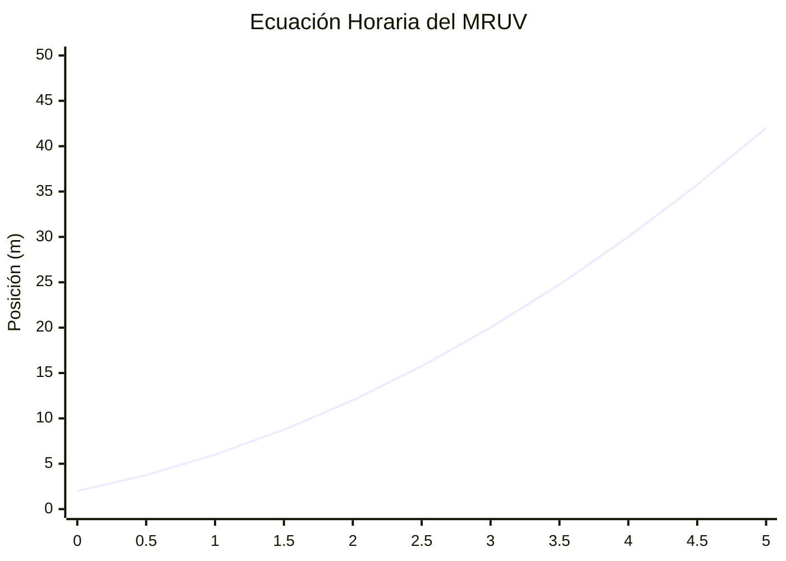
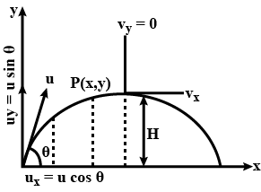

# Unidad 1 - Cinemática

## ¿Qué es la cinemática?

> Es la parte de la física que estudia el movimiento de los cuerpos desde un punto de vista descriptivo. Es decir, la cinemática responde a la pregunta: ¿cómo?... ¿Cómo se mueven los cuerpos? Cuando se realiza un estudio cinemático de un movimiento, no se tienen en cuenta las causas que producen los cambios.

## Descripción del Desplazamiento

> Para describir un movimiento es necesario en todos los casos analizar las variables cinemáticas y las relaciones matemáticas entre ellas.

## Posición, Velocidad, Aceleración y Tiempo

### Posición

> La posición de una partícula es la ubicación de la partícula respecto a un punto de referencia elegido que se considera el origen de un sistema de coordenadas.

### Desplazamiento

> El desplazamiento de una partícula se define como su cambio en posición en algún intervalo de tiempo.

$$
\Delta x = x_f - x_i
$$

### Velocidad Promedio

> La velocidad promedio de una partícula se define como el desplazamiento de la partícula dividido por el intervalo de tiempo durante el cual se produce el desplazamiento.

$$
v_{\text{prom}} = \frac{\Delta x}{\Delta t}
$$

#### Velocidad Instantánea

> La velocidad instantánea es el límite de la velocidad promedio cuando el intervalo de tiempo tiende a cero.

$$
v(t) = \lim_{\Delta t \to 0} \frac{\Delta x}{\Delta t} = \frac{dx}{dt}
$$

### Rapidez Media

> La rapidez media es la distancia total recorrida dividida por el intervalo de tiempo total.

$$
\text{Rapidez media} = \frac{s}{\Delta t}
$$

### Comparación entre Velocidad y Rapidez

| **Concepto** | **Velocidad ($(v)$)**             | **Rapidez ($(v)$)**                |
| ------------------ | --------------------------------------- | ---------------------------------------- |
| Naturaleza         | Vectorial (tiene dirección y sentido). | Escalar (solo magnitud).                 |
| Definición        | Desplazamiento dividido por tiempo.     | Distancia recorrida dividida por tiempo. |
| Ejemplo en MRU     | $(v = 3)$ m/s hacia la derecha.         | $(v = 3)$ m/s (magnitud).                |

---

### Aceleración Promedio

> La aceleración promedio de una partícula se define como el cambio en la velocidad de la partícula dividido por el intervalo de tiempo durante el cual se produce el cambio.

$$
a_{\text{prom}} = \frac{\Delta v}{\Delta t} = \frac{v_f - v_i}{t_f - t_i}
$$

#### Aceleración Instantánea

> La aceleración instantánea es el límite de la aceleración promedio cuando el intervalo de tiempo tiende a cero.

$$
a(t) = \lim_{\Delta t \to 0} \frac{\Delta v}{\Delta t} = \frac{dv}{dt}
$$

### Tiempo

> El tiempo es una magnitud física que se mide en segundos (s) y que se define como la duración de un suceso o intervalo entre dos sucesos.

## Vector Posición

> El vector posición $\vec{r}$ de una partícula es un vector que apunta desde el origen del sistema de coordenadas hasta la posición de la partícula.

$$
\vec{r}(t) = x(t)\hat{i} + y(t)\hat{j} + z(t)\hat{k}
$$

## Vector Desplazamiento

> El vector desplazamiento $\Delta \vec{r}$ es la diferencia entre las posiciones finales e iniciales de una partícula.

$$
\Delta \vec{r} = \vec{r}_f - \vec{r}_i
$$

## Distancia Recorrida

> La distancia recorrida es la longitud total del camino seguido por una partícula durante su movimiento, sin tener en cuenta la dirección.

$$
s = \int_{t_i}^{t_f} |\vec{v}(t)| dt
$$

## Movimiento Rectilíneo

> Es el movimiento de una partícula a lo largo de una línea recta.

### Movimiento Rectilíneo Uniforme (MRU)

> En el MRU, la partícula se mueve con velocidad constante, es decir, la aceleración es cero.

$$
v = \text{constante}
$$

#### Ecuación Horaria del MRU

La posición en función del tiempo se describe por la ecuación:

$$
x(t) = x_0 + v t
$$

#### Consecuencias del MRU

* Un móvil en MRU no cambia el módulo, la dirección ni el sentido de su velocidad; por lo tanto, la trayectoria es una recta.
* Una velocidad constante solo se puede dar en una trayectoria recta.
* En un MRU, el valor de la velocidad y la rapidez entre dos posiciones coinciden.
* Un móvil en MRU no cambia la dirección, el módulo ni el sentido de su velocidad, por lo tanto, no tiene aceleración.
* Si un móvil no acelera, su trayectoria es una recta.
* Si un móvil tiene velocidad constante, su rapidez también será constante y recorrerá distancias iguales en tiempos iguales.

### Ejemplo de MRU

Considera la ecuación de un MRU:

$$
x(t) = 3t + 1
$$

Donde:

* $(x_0)$: Posición inicial (en metros, m).
* $(v)$: Velocidad constante (en metros por segundo, m/s).
* $(t)$: Tiempo transcurrido (en segundos, s).

### Interpretación gráfica

En una gráfica de **posición $(x)$** contra **tiempo $(t)$**:

* La pendiente de la recta representa la **velocidad**.
* Una pendiente mayor implica mayor velocidad.
* Una línea horizontal ($(v = 0)$) indica que el objeto está en reposo.

---

### Movimiento Rectilíneo Uniformemente Variado (MRUV)

> En el MRUV, la partícula tiene una aceleración constante.

$$
a = \text{constante}
$$

#### Ecuaciones del MRUV

##### Ecuación Horaria del MRUV

$$
x(t) = x_0 + v_0 t + \frac{1}{2} a t^2
$$

Velocidad en función del tiempo:

$$
v(t) = v_0 + a t
$$

Velocidad en función de la posición:

$$
v^2 = v_0^2 + 2 a (x - x_0)
$$

#### Demostración de la Ecuación Horaria del MRUV

##### Sección 2.6: La Partícula Bajo Aceleración Constante

Cuando una partícula se mueve con aceleración constante, su análisis se simplifica significativamente. A continuación, se presenta una demostración paso a paso de cómo se obtiene la **ecuación horaria del Movimiento Rectilíneo Uniformemente Variado (MRUV)**.

##### 1. Definición de Aceleración Constante

La **aceleración constante** $( a )$ se define como la tasa de cambio de la velocidad con respecto al tiempo:

$$
a = \frac{\Delta v}{\Delta t}
$$

Dado que $( a )$ es constante, podemos integrar esta relación para encontrar la **velocidad en función del tiempo**.

##### 2. Derivación de la Velocidad en Función del Tiempo

Partiendo de la definición de aceleración:

$$
a = \frac{dv}{dt}
$$

Integrando ambos lados respecto al tiempo desde $( t = 0 )$ hasta $( t = t )$:

$$
\int_{v_0}^{v(t)} dv = \int_{0}^{t} a \, dt
$$

$$
v(t) - v_0 = a t
$$

Por lo tanto, la velocidad en cualquier instante $( t )$ es:

$$
v(t) = v_0 + a t \quad \text{(Ecuación 2.13)}
$$

##### 3. Derivación de la Posición en Función del Tiempo

Sabemos que la **velocidad** es la derivada de la **posición** respecto al tiempo:

$$
v(t) = \frac{dx}{dt} = v_0 + a t
$$

Para encontrar la posición en función del tiempo, integramos la velocidad:

$$
\int_{x_0}^{x(t)} dx = \int_{0}^{t} (v_0 + a t) \, dt
$$

Realizando la integración:

$$
x(t) - x_0 = v_0 t + \frac{1}{2} a t^2
$$

Por lo tanto, la posición en función del tiempo es:

$$
x(t) = x_0 + v_0 t + \frac{1}{2} a t^2 \quad \text{(Ecuación Horaria del MRUV)}
$$

##### 4. Resumen de la Ecuación Horaria del MRUV

La **ecuación horaria del MRUV** describe la posición de una partícula en movimiento rectilíneo con aceleración constante en función del tiempo $( t )$. La ecuación final es:

$$
x(t) = x_0 + v_0 t + \frac{1}{2} a t^2
$$

Donde:

* $( x(t) )$ es la posición en el tiempo $( t )$.
* $( x_0 )$ es la posición inicial.
* $( v_0 )$ es la velocidad inicial.
* $( a )$ es la aceleración constante.
* $( t )$ es el tiempo transcurrido.

##### 5. Interpretación de la Ecuación Horaria

* **Término $( x_0 )$**: Representa la posición inicial de la partícula en $( t = 0 )$.
* **Término $( v_0 t )$**: Indica el desplazamiento debido a la velocidad inicial durante el tiempo $( t )$.
* **Término $( \frac{1}{2} a t^2 )$**: Representa el desplazamiento adicional debido a la aceleración constante durante el tiempo $( t )$.

Esta ecuación muestra cómo la posición de la partícula depende linealmente del tiempo debido a la velocidad inicial y cuadráticamente debido a la aceleración.

##### 6. Ejemplo de Aplicación

Considera una partícula con:

* Posición inicial $( x_0 = 2 )$ m,
* Velocidad inicial $( v_0 = 3 )$ m/s,
* Aceleración constante $( a = 2 )$ m/s².

Usando la ecuación horaria del MRUV:

$$
x(t) = 2 \, \text{m} + (3 \, \text{m/s}) t + \frac{1}{2} (2 \, \text{m/s}^2) t^2
$$

Simplificando:

$$
x(t) = 2 + 3t + t^2 \quad \text{(m)}
$$

Esto significa que, para cualquier instante de tiempo $( t )$, podemos calcular la posición de la partícula sustituyendo el valor de $( t )$ en la ecuación.

##### 7. Gráfica de la Ecuación Horaria del MRUV

La gráfica de $( x(t) )$ frente a $( t )$ para el MRUV con aceleración constante es una **parábola**. La forma de la gráfica refleja el término cuadrático $( \frac{1}{2} a t^2 )$, indicando que el desplazamiento adicional debido a la aceleración aumenta con el tiempo.

#### Consecuencias del MRUV

Puesto que la velocidad con aceleración constante varía linealmente en el tiempo se expresa la velocidad promedio en cualquier intervalo de tiempo como la media aritmética de la velocidad inicial $(v_{xi})$ y la velocidad final $(v_{xf})$.

$$
v_{\text{prom}} = \frac{v_{xi} + v_{xf}}{2}
$$

### Caída Libre (CL) y Tiro Vertical (TV)

Ambos son ejemplos de Movimiento Rectilíneo Uniformemente Variado (M.R.U.V.) con trayectoria vertical rectilínea.

#### Caída Libre (CL)

> Es el movimiento de un objeto que cae únicamente bajo la influencia de la gravedad, sin considerar la resistencia del aire.

**Características:**

* Movimiento vertical hacia abajo.
* Aceleración constante debido a la gravedad, $( g \approx 9.8 \, \text{m/s}^2 )$.
* Velocidad que aumenta continuamente con el tiempo.

**Ecuaciones de la Caída Libre:**

* **Posición en función del tiempo:**
  $$
  y(t) = y_0 - \frac{1}{2} g t^2
  $$
* **Velocidad en función del tiempo:**
  $$
  v(t) = -g t
  $$
* **Ecuación de los cuadrados:**
  $$
  v^2 = v_0^2 + 2 g (y - y_0)
  $$

#### Tiro Vertical (TV)

> Es el movimiento de un objeto lanzado verticalmente hacia arriba o hacia abajo bajo la influencia de la gravedad.

**Características:**

* Movimiento vertical ascendente o descendente.
* Aceleración constante debido a la gravedad, $( g \approx 9.8 \, \text{m/s}^2 )$, siempre apuntando hacia abajo.
* Cuando se lanza hacia arriba, la velocidad inicial $( v_0 )$ es positiva y disminuye hasta 0 en el punto más alto, luego aumenta negativamente durante la caída.

**Ecuaciones del Tiro Vertical:**

* **Posición en función del tiempo:**
  $$
  y(t) = y_0 + v_0 t - \frac{1}{2} g t^2
  $$

* **Velocidad en función del tiempo:**
  $$
  v(t) = v_0 - g t
  $$

* **Ecuación de los cuadrados:**
  $$
  v^2 = v_0^2 - 2 g (y - y_0)
  $$

**Demostración de la Ecuación de Posición:**

1. **Definición de Aceleración:**
  $$
  a = -g
  $$

2. **Integración para la Velocidad:**
  $$
  v(t) = v_0 + a t = v_0 - g t
  $$

3. **Integración para la Posición:**
  $$
  y(t) = y_0 + v_0 t + \frac{1}{2} a t^2 = y_0 + v_0 t - \frac{1}{2} g t^2
  $$

## Tiro Parabólico

> Es el movimiento de un objeto lanzado con una velocidad inicial que tiene componentes en dos direcciones perpendiculares, generalmente horizontal y vertical, produciendo una trayectoria en forma de parábola.

### Ecuaciones del Tiro Parabólico

La posición del proyectil en los ejes horizontal y vertical se describe mediante las siguientes ecuaciones:

**Posición en el eje horizontal:**

$$
x(t) = v_{0x} t = v_0 \cos(\theta) \, t
$$

**Posición en el eje vertical:**

$$
y(t) = v_{0y} t - \frac{1}{2} g t^2 = v_0 \sin(\theta) \, t - \frac{1}{2} g t^2
$$

**Velocidad en el eje horizontal:**

$$
v_x(t) = v_{0x} = v_0 \cos(\theta)
$$

**Velocidad en el eje vertical:**

$$
v_y(t) = v_{0y} - g t = v_0 \sin(\theta) - g t
$$

**Velocidad total:**

$$
v(t) = \sqrt{v_x^2 + v_y^2} = \sqrt{ \left( v_0 \cos(\theta) \right)^2 + \left( v_0 \sin(\theta) - g t \right)^2 }
$$

**Tiempos de Vuelo:**

  $$
  T = \frac{2 v_0 \sin(\theta)}{g}
  $$

### Alcance y Altura Máxima

* **Alcance Horizontal ($( R )$)**: La distancia máxima que recorre el proyectil en el eje horizontal se obtiene cuando $( y = 0 )$.

  $$
  \Delta_{xM} = \frac{v_0^2 \sin(2\theta)}{g}
  $$
* **Altura Máxima ($( H )$)**: La máxima altura alcanzada por el proyectil.

  $$
  H_m = \frac{v_0^2 \sin^2(\theta)}{2g}
  $$

### Gráfica de la Trayectoria

La trayectoria de un tiro parabólico es una parábola que depende del ángulo de lanzamiento $( \theta )$ y la velocidad inicial $( v_0 )$.

### Consideraciones Importantes

* **Sin Resistencia del Aire:** Este modelo asume que no hay fuerzas de resistencia, lo cual simplifica el análisis.
* **Movimiento Independiente:** Los movimientos en los ejes horizontal y vertical son independientes entre sí.
* **Simetría de la Trayectoria:** El tiempo de ascenso es igual al tiempo de descenso si el nivel de lanzamiento y aterrizaje es el mismo.

### Ejemplo Práctico

**Problema:** Un proyectil es lanzado con una velocidad inicial de $( 20 \, \text{m/s} )$ a un ángulo de $( 30^\circ )$. Calcular el alcance y la altura máxima.

1. **Componentes de la Velocidad:**

   $$
   _{0x} = 20 \cos(30^\circ) \approx 17.32 \, \text{m/s}
   $$

   $$
   _{0y} = 20 \sin(30^\circ) = 10 \, \text{m/s}
   $$
2. **Alcance Horizontal:**

   $$
   = \frac{(20)^2 \sin(60^\circ)}{9.8} \approx \frac{400 \times 0.866}{9.8} \approx 35.3 \, \text{m}
   $$
3. **Altura Máxima:**

   $$
   = \frac{(10)^2}{2 \times 9.8} \approx \frac{100}{19.6} \approx 5.10 \, \text{m}
   $$

Este ejemplo demuestra cómo calcular las principales características de un tiro parabólico utilizando las ecuaciones derivadas.
